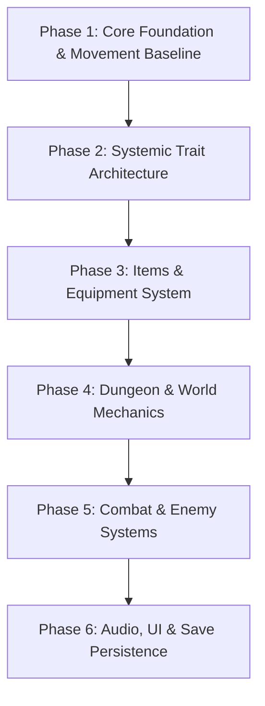

# Zeldavania - Roadmap & Game Design Document

## 1. Game Overview & Vision

**Title:** Zeldavania  
**Genre:** 2D Side-Scrolling Action-Adventure / Metroidvania ("Zeldavania")  
**Engine:** Godot 4.7+ (.NET / C#)  
**Core Concept:** Merging the exploration, platforming fluidity, and interconnected ability-gating of a Metroidvania with the dungeon design, puzzle-solving, items, and systemic world interactions of classic *The Legend of Zelda*.

---

## 2. Core Gameplay Pillars

1. **Systemic & Trait-Based World Interaction**
   - Game objects and entities interact through modular, shared traits rather than hardcoded one-off scripts.
   - For example, anything with the `Flammable` trait reacts consistently when touched by a `Fire` source (torches ignite, wooden shields burn, dry vines clear passageways).
2. **Fluid 2D Platforming & Exploration**
   - Precise and responsive 2D movement (climbing, rolling, swimming, crouching, dropping through one-way platforms).
   - Rich camera and room transitions connecting an interconnected overworld to self-contained dungeons.
3. **Zelda-Style Dungeons & Progression Gating**
   - Themed labyrinthian dungeons featuring locked doors, small keys, master/boss keys, dungeon map/compass, and mini-bosses.
   - Finding a new dungeon item (e.g., Bow, Bombs, Lens of Truth, Diving Gear) unlocks both puzzle solutions within the dungeon and new pathways across the overworld.
4. **Emergent Combat & Puzzle Solving**
   - Items double as both navigation/puzzle tools and tactical combat options.

---

## 3. Systemic Trait Matrix (Draft)

| Trait / Element | Interaction Source | Effect / Behavior | Examples |
| :--- | :--- | :--- | :--- |
| **`Flammable`** | Fire Arrow, Torch, Campfire | Ignites entity, spreads fire to adjacent flammables, burns barriers over time | Torches, dry vines, wooden barricades, enemy shields |
| **`Breakable` / `Bombable`** | Bomb explosion, Heavy Hammer | Shatters object, drops loot, or clears passage | Cracked stone walls, fragile pots, breakable floor tiles |
| **`Illusion` / `Hidden`** | Lens of Truth, Light Beacon | Reveals invisible platforms, hidden passages, or false walls | Illusionary walls, invisible ghost platforms |
| **`Diveable` / `Aquatic`** | Diving Gear, Heavy Boots | Allows underwater movement, alters buoyancy & physics | Deep water pools, submerged dungeon tunnels |
| **`Conductive`** | Electric / Lightning item | Conducts current across circuits, activates switches | Metal switches, wire puzzles, electrified water |
| **`Freezable`** | Ice attack / Cold element | Freezes water into walkable ice platforms, freezes enemies | Waterfalls turned into climbing surfaces |

---

## 4. Development Roadmap

### Phase 1: Core Foundation & Baselines (In Progress)
- [x] Godot 4.7+ .NET 8 Project Setup
- [x] Node-based Finite State Machine (`FiniteStateMachine`, `State`)
- [x] Core Player States (Standing, Running, Jumping, Falling, Landing, Crouching, Rolling, Climbing, Swimming)
- [x] Tile detection for ladders/water (`TileDetector2D`)
- [x] Baseline existing mechanics into spec documentation (retroactive OpenSpec baseline)

### Phase 2: Systemic Trait Architecture
- [ ] Design component-based Trait system (e.g., `FlammableComponent`, `BreakableComponent`, `HurtboxComponent`/`HitboxComponent`)
- [ ] Implement `Flammable` trait & dynamic fire propagation (igniting torches, spreading to adjacent flammables)
- [ ] Implement `Breakable` trait (cracked wall crumbling, pot smashing)
- [ ] Implement `WaterVolume` & buoyancy physics for swimming/diving

### Phase 3: Items & Equipment System
- [ ] Inventory and active item switching system
- [ ] **Bow & Arrows** (Normal arrows, Fire arrows)
- [ ] **Bombs** (Placeable/throwable explosives with timer and blast radius)
- [ ] **Lens of Truth / Magic Sight** (Shader or overlay revealing illusion layers)
- [ ] **Diving Equipment / Flippers** (Unlocking underwater depth and submerged navigation)

### Phase 4: World & Dungeon Mechanics
- [ ] Door & Key System (Small Keys, Boss Keys, Puzzle Lock triggers)
- [ ] Dungeon layout design (Room transitions, camera framing, one-way gates)
- [ ] Pressure plates, switches, and puzzle state persistence
- [ ] Checkpoint / Respawn / Save statues

### Phase 5: Enemies & Bosses
- [ ] Enemy base state machine & AI behaviors (Patrolling, Alert, Attacking, Stunned, Dying)
- [ ] Systemic enemy interactions (wooden enemies catching fire, armored enemies vulnerable to bombs)
- [ ] First Dungeon Boss Encounter combining movement and item mechanics

### Phase 6: UI, Audio & Progression
- [ ] HUD (Hearts/Health, Magic/Stamina, Active Item, Key Count)
- [ ] Pause & Inventory screen
- [ ] Sound effects, ambient audio, and dynamic music layers
- [ ] Save/Load game state serialization
