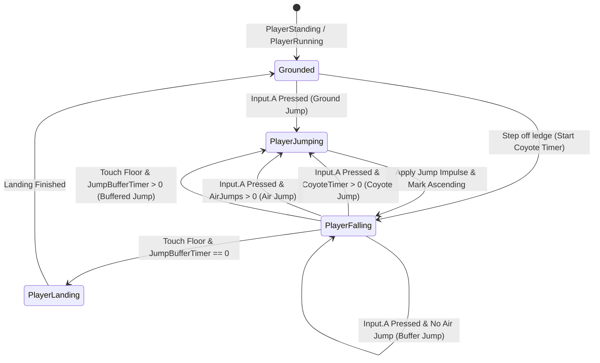

# Technical Design: Jump Mechanics Polish

## Overview
This design outlines the implementation of **Variable Jump Height (Jump Cut)**, **Coyote Time**, and **Jump Buffering** across the player platforming states (`PlayerJumping`, `PlayerFalling`, `PlayerLanding`, `PlayerStanding`, `PlayerRunning`).

## Architecture & State Machine Flow



## State & Class Modifications

### 1. `PlayerFalling.cs`
`PlayerFalling` manages airborne physics and is the primary coordinator for jump cut, coyote time, and jump buffering.

#### Export Fields
```csharp
[ExportGroup("Jumping & Aerial Tuning")]
[Export]
private State _jumpingState;

[Export]
private float _coyoteTime = 0.10f; // 100ms ledge grace window

[Export]
private float _jumpBufferTime = 0.10f; // 100ms landing buffer window

[Export]
private float _jumpCutMultiplier = 0.5f; // Velocity damping when jump is released during ascent
```

#### State Tracking & Methods
- `private float _coyoteTimer;`
- `private float _jumpBufferTimer;`
- `private bool _isAscendingFromJump;`
- `public void EnableCoyoteTime()`: Called when transitioning from grounded states into `PlayerFalling` without jumping.
- `public void NotifyJumpAscent()`: Called when transitioning from `PlayerJumping` into `PlayerFalling` to track jump cut opportunity.
- `public void ConsumeJumpBuffer()`: Clears the jump buffer when executed.

#### Physics & Input Lifecycle
1. **Entering `PlayerFalling`**:
   - If not coming from a jump (or explicitly flagged), `_coyoteTimer = _coyoteTime`.
   - If coming from `PlayerJumping`, `_isAscendingFromJump = true; _coyoteTimer = 0;`.
2. **Updating Physics (`UpdatePhysics`)**:
   - Decrement `_coyoteTimer` and `_jumpBufferTimer` by `delta`.
   - **Jump Cut**:
     - While `_isAscendingFromJump` is true and `_body.Velocity.Y < 0`:
       - If `Input.IsActionJustReleased(Controller.A)` or `!Input.IsActionPressed(Controller.A)`:
         - `_body.Velocity = new Vector2(_body.Velocity.X, _body.Velocity.Y * _jumpCutMultiplier);`
         - `_isAscendingFromJump = false;`
     - If `_body.Velocity.Y >= 0`, reset `_isAscendingFromJump = false`.
   - **Airborne Jump Input (`Input.IsActionJustPressed(Controller.A)`)**:
     - If `_coyoteTimer > 0`:
       - `_coyoteTimer = 0;`
       - Transition(`_jumpingState`);
     - Else if `_airJumpsRemaining > 0`:
       - `_airJumpsRemaining--;`
       - Transition(`_airJumpingState`);
     - Else:
       - `_jumpBufferTimer = _jumpBufferTime;` (Buffer for floor landing)
   - **Landing (`_body.IsOnFloor()`)**:
     - Reset `_airJumpsRemaining = _airJumps;`
     - If `_jumpBufferTimer > 0`:
       - `_jumpBufferTimer = 0;`
       - Transition(`_jumpingState`);
     - Else:
       - Transition(`_landingState`);

### 2. `PlayerJumping.cs`
- In `PlayerJumping.Enter()`, apply jump impulse (`_body.Velocity = new Vector2(_body.Velocity.X, -_velocity)`).
- When transitioning to `_fallingState`, invoke `(_fallingState as PlayerFalling)?.NotifyJumpAscent()`.

### 3. `PlayerStanding.cs` & `PlayerRunning.cs`
- When detecting `!_body.IsOnFloor()`, call `(_fallingState as PlayerFalling)?.EnableCoyoteTime()` before calling `Transition(_fallingState)`.

### 4. `PlayerLanding.cs`
- If `PlayerFalling` has an active jump buffer when landing or if landing detects a buffered jump, transition directly to `_jumpingState`.

## Scene Wiring & Inspector Configuration
- Inspect `Player.tscn` -> `PlayerFalling` node:
  - Assign `_jumpingState` node reference to `PlayerJumping`.
  - Set default tuning: `_coyoteTime = 0.1`, `_jumpBufferTime = 0.1`, `_jumpCutMultiplier = 0.5`.
